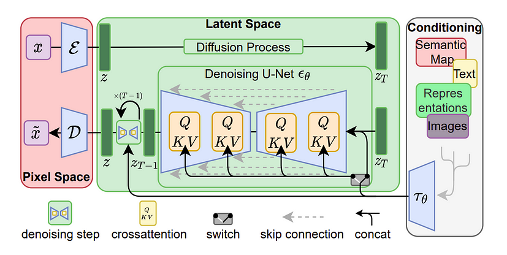

# Stable Diffusion with Styles

- In this repository, Stable Diffusion is used to generate images.
- Images are created based on the prompt provided.
- Generation of images is enhanced by using concept embeddings.
- The concept embeddings are obtained from one of the three sources:
    - Using SD concept library
    - Using CLIP model to generate embeddings for the concept text provided.
    - Creating SD concept library from a set of images.
- In addition to the concept style, a custom loss function (vignette loss) is used to enhance the image generation.  


## Implementation Overview



- Noisy Latent space from Variational Autoencoder (VAE) is used as the input.
- The prompt is encoded using CLIP model to get the text embeddings.
- The input is passed through the UNet model to get the denoised latent space.
- During the denoising process, the concept embeddings are added to the latent space to enhance the image generation.
- A custom loss function (vignette loss) is also added during reverse diffusion process to enhance the image generation.
- The final image is obtained by passing the denoised latent space through the VAE decoder.
- The implementation is available in this [Notebook](Guided_Stable_Diffusion_with_Styles.ipynb)  


## Custom Loss Function (Vignette Loss)

- The vignette loss is a custom loss function that is used to enhance the image generation.
- Below is the implementation of the vignette loss function:
    ```python
    def vignette_loss(images, vignette_strength=3.0, color_shift=[1.0, 0.5, 0.0]):
    """
    Creates a strong vignette effect (dark corners) and color shift.
    This loss function produces very obvious visual changes that are impossible to miss.

    :param images: Batch of images from VAE decoder (range 0-1)
    :param vignette_strength: How strong the darkening effect is (higher = more dramatic)
    :param color_shift: RGB color to shift the center toward [r, g, b]

    :return: torch.Tensor: Loss value
    """
    batch_size, channels, height, width = images.shape

    # Create coordinate grid centered at 0 with range [-1, 1]
    y = torch.linspace(-1, 1, height).view(-1, 1).repeat(1, width).to(images.device)
    x = torch.linspace(-1, 1, width).view(1, -1).repeat(height, 1).to(images.device)

    # Calculate radius from center (normalized [0,1])
    radius = torch.sqrt(x.pow(2) + y.pow(2)) / 1.414

    # Vignette mask: dark at edges, bright in center
    vignette = torch.exp(-vignette_strength * radius)

    # Color shift target: shift center toward specified color
    color_tensor = torch.tensor(color_shift, dtype=torch.float32).view(1, 3, 1, 1).to(images.device)
    center_mask = 1.0 - radius.unsqueeze(0).unsqueeze(0)
    center_mask = torch.pow(center_mask, 2.0)  # Make the transition more dramatic

    # Target image with vignette and color shift
    target = images.clone()

    # Apply vignette (multiply all channels by vignette mask)
    for c in range(channels):
        target[:, c] = target[:, c] * vignette

    # Apply color shift in center
    for c in range(channels):
        # Shift toward target color more in center, less at edges
        color_offset = (color_tensor[:, c] - images[:, c]) * center_mask
        target[:, c] = target[:, c] + color_offset.squeeze(1)

    # Calculate loss - how different current image is from our target
    return torch.pow(images - target, 2).mean()
    ```

- The vignette loss function is used to enhance the image generation by creating a strong vignette effect (dark corners) and color shift.
- The vignette loss function produces very obvious visual changes that are impossible to miss.
- The vignette loss function is used during the reverse diffusion process to enhance the image generation.

---

## Try it out!

- The application is available on Hugging Face Space.
- The application is available [here](https://huggingface.co/spaces/shilpaj/Stable-Diffusion-with-Styles)

---

## References
- [SD concept library](https://huggingface.co/sd-concepts-library)
- [Create custom concept](https://colab.research.google.com/github/huggingface/notebooks/blob/main/diffusers/sd_textual_inversion_training.ipynb#scrollTo=gTlUJYB1QNSN)
- [Stable Diffusion Deep Dive](https://github.com/fastai/diffusion-nbs/blob/master/Stable%20Diffusion%20Deep%20Dive.ipynb)
