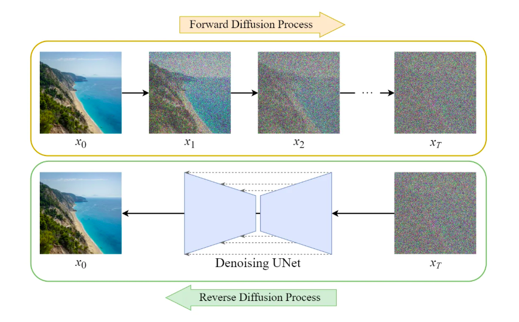
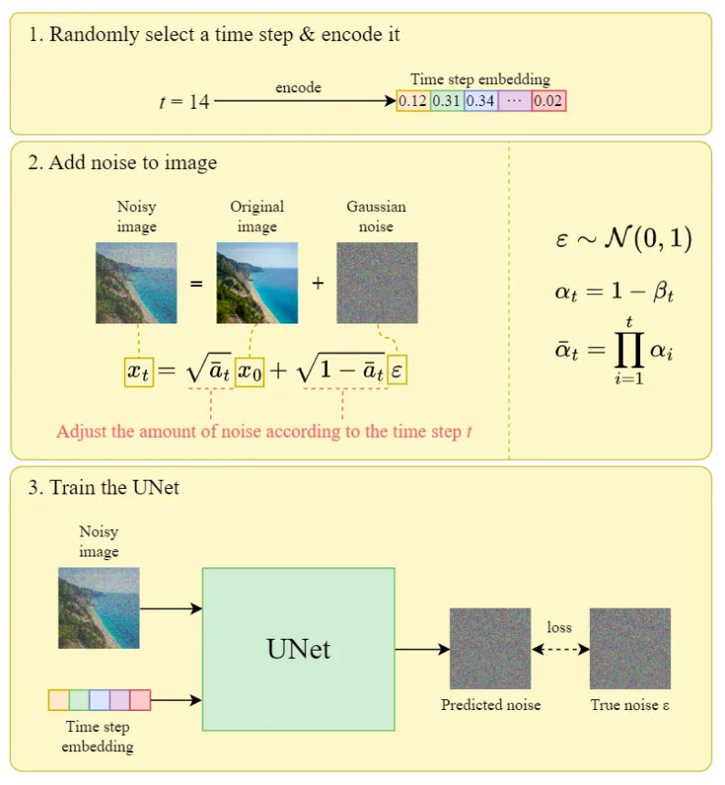
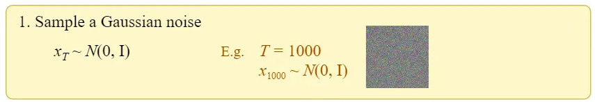
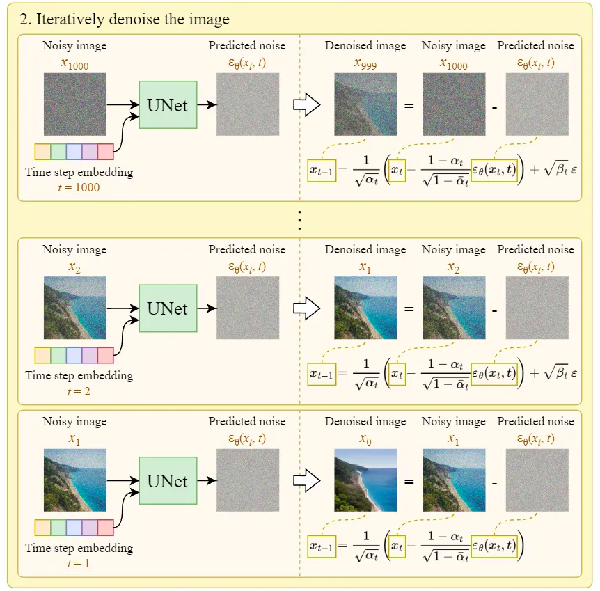
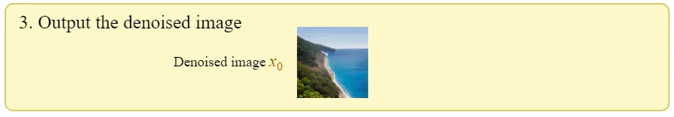
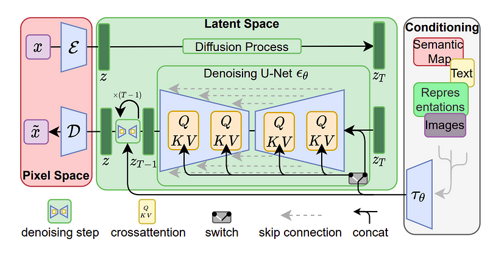

# Stable Diffusion and Advanced Generative Techniques

## Diffusion Models

**Diffusion models** are a class of **probabilistic generative models** that **learn to generate data by gradually denoising a noisy sample**. They have become the backbone of **state-of-the-art generative models** like **Stable Diffusion, DALLE-2, Imagen, and GenAI tools**.

### 1. Training / Forward Diffusion

Once we have trained the UNet above, we work on the **Sampling**, which is to start with Gaussian noise and end with a generated image

### 2. Reverse Diffusion / Denoising / Sampling

- **Diffusion models** are a broad class of **generative models** that generate data by gradually removing noise. **Stable Diffusion**, on the other hand, is a **specific implementation** of diffusion models optimized for efficiency and real-world use.

- They are mostly used for denoising applications
- Guidance is also added to them when they are used for generation

---

## Stable Diffusion

**Stable Diffusion** is a **state-of-the-art text-to-image model** based on **Latent Diffusion Models (LDMs)**, developed by **CompVis, Stability AI, and Runway ML**. It generates high-quality images from text prompts, using a **diffusion-based approach** that progressively refines images from noise.

- Using Diffusion model, we can create images by gradually removing noise
- But we don't just want to create an image, we want to create an image based on some text

### Guidance

- In order to create images based on text, what if we send label of the image as well?
- Since our network has more information, it would be better to predict the noise that can be removed to get the image (with the same label) back. 
- This process is called **guidance**. 
- The problem with the above approach is that we want to work with text sentences and not just a simple class label. 
- This is where **CLIP** comes into the picture! We train the text and image encoder in CLIP on millions of images to make sure that the text-encoded vector and image-encoded vector are the same. So instead of sending in class labels, we'll be sending in CLIP's text-encoded vectors. 

There are three main components of stable diffusion:

1. AutoEncoder (VAE) [Because we want to create images which are mixture of classes like keychain of elephant]
2. UNet  [To remove noise while image generation]
3. Text-Encoder (CLIP)  [For Guidance to send text encoding for the prompt]

### AutoEncoder (VAE)

- The VAE model has two parts, an encoder, and a decoder. 
- The encoder is used to convert the image into a low-dimensional latent representation, which will serve as the input to the U-Net model. 
- The Decoder will transform the latent representation back into an image. 
- **This auto-encoder is pretrained**.
- In the above image, the red encoder and decoder parts are from AutoEncoder

 

### **U-Net**

- The U-Net has an encoder part and a decoder path, both comprised of ResNet Block. 
- Here's the [codeLinks to an external site.](https://nn.labml.ai/diffusion/stable_diffusion/model/unet.html) for the U-Net used in Stable Diffusion. 
- **This U-Net is actually what gets trained.** 
- In the above image, the green part is UNet which predicts noise in the latent space.

 

### **CLIP Model**

- Clip model is used to get the text embeddings. 
- **This CLIP model is also pre-trained.**
- In the above image, conditioning is done using CLIP

### Stable Diffusion Vs Diffusion

| Feature                | Diffusion Models (General) | Stable Diffusion (LDM)         |
| ---------------------- | -------------------------- | ------------------------------ |
| **Noise Process**      | In **pixel space**         | In **latent space**            |
| **Efficiency**         | **Very slow** & costly     | **Faster** & GPU-friendly      |
| **Text Conditioning**  | Not built-in               | Uses **CLIP** for text prompts |
| **Memory Requirement** | High (10s-100s GBs)        | **Low (8GB VRAM+ can run it)** |
| **Customization**      | Limited                    | LoRA, DreamBooth, ControlNet   |

---

## Würstchen

###  **Key Features of Würstchen**

1. **Triple-Stage Latent Space Diffusion**
   - Unlike Stable Diffusion, which operates in a single latent space, Würstchen uses a three-step pipeline:
     1. **Stage 1: Extreme Image Compression** (using a **highly compressed latent space**)
     2. **Stage 2: Diffusion in a Tiny Latent Space** (greatly reducing computational cost)
     3. **Stage 3: Super-resolution Refinement** (to generate high-quality images)
2. **100x Smaller Latent Space**
   - Standard **Stable Diffusion** models work in a **4× downscaled** latent space.
   - **Würstchen operates in a 42× downscaled latent space**, making diffusion **orders of magnitude faster**.
3. **Faster Inference & Lower VRAM Usage**
   - Can generate **4K images using just 4GB of VRAM**.
   - 2×–10× **faster than Stable Diffusion** due to reduced latent space operations.
4. **Text-to-Image Generation**
   - Uses a **CLIP text encoder** to guide generation like Stable Diffusion.
   - Maintains **fine details** despite aggressive compression.

### **How Würstchen Works**

1. **Compression (VAE-like Model)** → Encodes high-res images into a **super small latent space**.
2. **Diffusion in Compressed Space (U-Net)** → Generates images in the ultra-small latent space.
3. **Super-Resolution (Decoder)** → Upscales the image back to full resolution.

### Würstchen Vs Stable Diffusion

| Feature               | **Stable Diffusion** | **Würstchen**                            |
| --------------------- | -------------------- | ---------------------------------------- |
| **Latent Space Size** | 4× downscaled        | **42× downscaled**                       |
| **Computation Speed** | Moderate             | **Much Faster (2×–10× faster)**          |
| **VRAM Usage**        | 8GB+ (for SDXL)      | **4GB+ (for high-res images)**           |
| **Output Quality**    | High                 | **Comparable, but more efficient**       |
| **Training Cost**     | High                 | **Lower due to compressed latent space** |